# Revenue-Prediction
HW1 - Lab 2 course in data science

``` python

import numpy as np
import pandas as pd
from preprocess import *
pd.set_option('display.max_columns', None)
from matplotlib.colors import rgb_to_hsv
import seaborn as sns
from sklearn.metrics import mean_squared_log_error
import matplotlib.pyplot as plt
import time
import xgboost as xgb
import lightgbm as lgb
from sklearn.ensemble import RandomForestRegressor
from sklearn.linear_model import LinearRegression
from sklearn.model_selection import RandomizedSearchCV
%matplotlib inline
sns.set(font_scale=1.3)

import warnings
warnings.filterwarnings('ignore')
```

``` python
folder_path_data = 'hw1_data/'
train_raw = pd.read_csv(folder_path_data +'train.tsv',delimiter='\t')
test_raw = pd.read_csv(folder_path_data + 'test.tsv',delimiter='\t')
```

## Exploratory Data Analysis
``` python
train_raw.head()
```

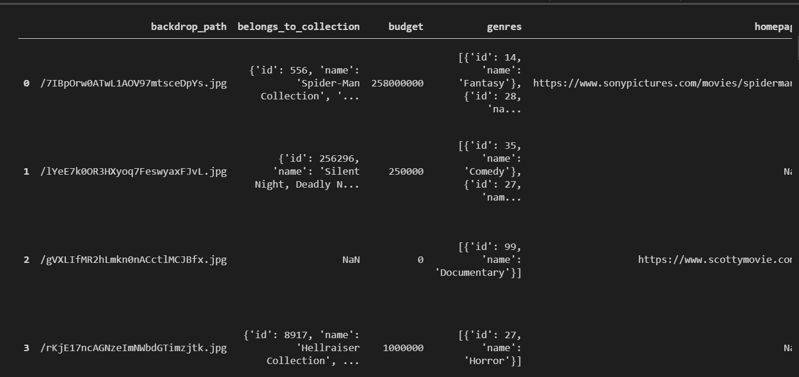

``` python
test_raw.head()
```

 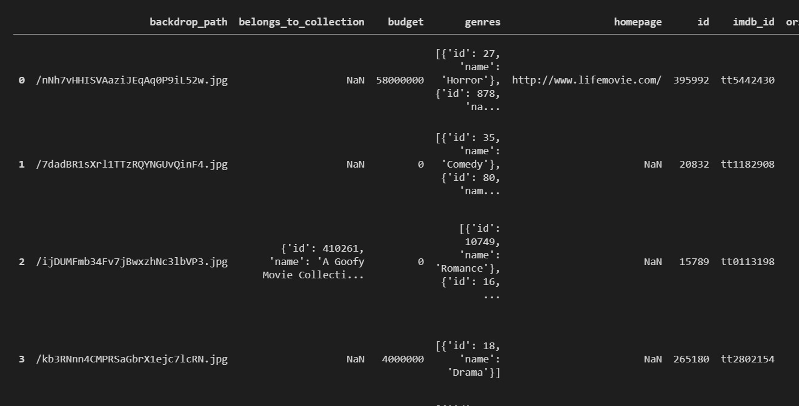
 
### Check dataset unique values
``` python
# Train
counts_train = train_raw.nunique()
counts_train
```

 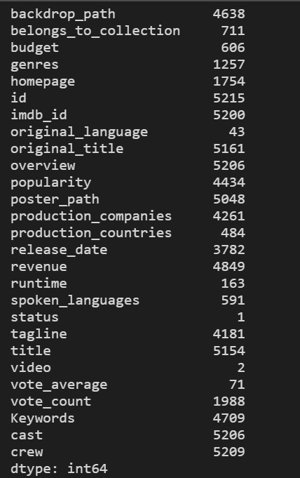

```python
# Test
counts_test = test_raw.nunique()
counts_test
```

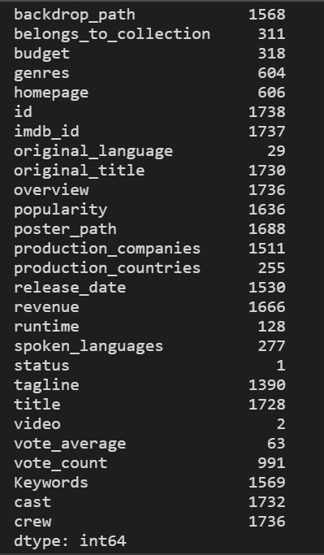

### Check categorical cols (un-nested) distibution: video & status

```python
train_raw['video'].value_counts().plot(kind='bar')
plt.title('Video distribution')
plt.ylabel('Number of records')
plt.xticks(rotation=360)
```
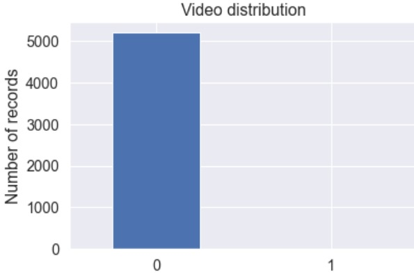


```python
train_raw['status'].value_counts().plot(kind='bar')
plt.title('Status distribution')
plt.ylabel('Number of records')
plt.xticks(rotation=360)
```
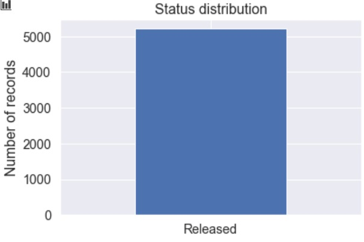

- As we can see the train dataset & test dataset are in the same structure and both contain nested columns 
- we will unpack the nested structures later on. Those columns are all Strings.
- There are no duplicate rows in both datasets
- All movies are 'Realesed' and therfore <b>Status</b> column, containing only 1 value, has no impact and won't be in use

### Let's see some statistics about the numerical columns:
```python
train_raw.describe().apply(lambda s: s.apply(lambda x: format(x, 'g')))
```

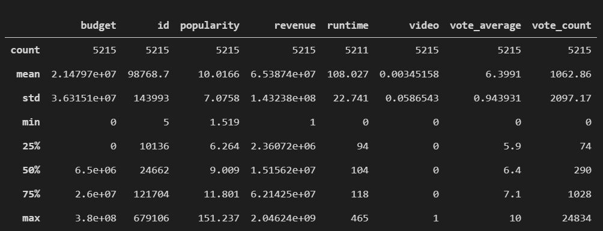

```python
test_raw.describe().apply(lambda s: s.apply(lambda x: format(x, 'g')))
```


- We can see that both train & test contain uncertain data - rows with runtime = 0 , budget = 0 
- We will treat those values as missing data and they will be imputed later on.

```python
print(f"Train dataset: Amount of movies with 0 budget: {len(train_raw[train_raw['budget'] == 0])}")
print(f"Train dataset: Amount of movies with 0 runtime: {len(train_raw[train_raw['runtime'] == 0])}")
print(f"Test dataset : Amount of movies with 0 budget: {len(test_raw[test_raw['budget'] == 0])}")
print(f"Test dataset : Amount of movies with 0 budget: {len(test_raw[test_raw['runtime'] == 0])}")
```
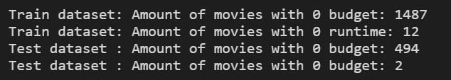


### Features distribution & comparative analysis between features
``` python
sns.pairplot(train_raw.select_dtypes('number').drop(columns='id'), kind="reg", diag_kind="kde")
plt.show()
```
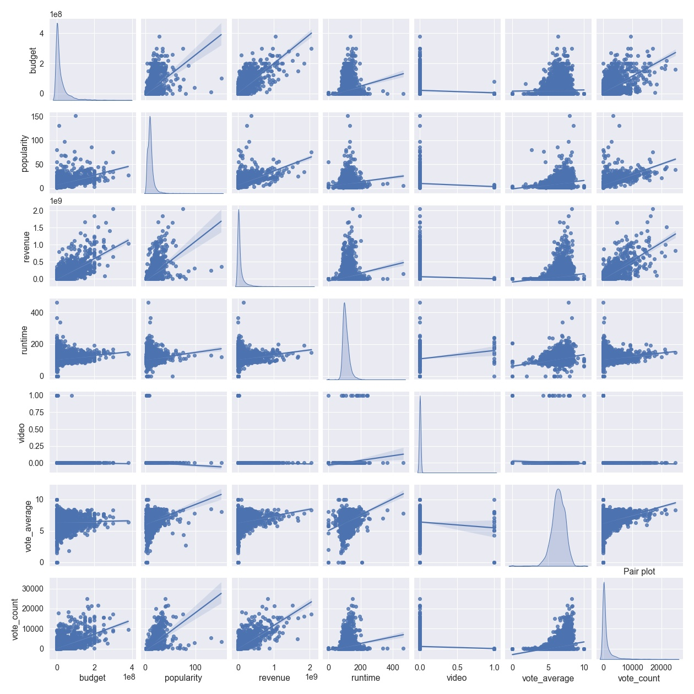

* In the main diagonal we can see each of the numerical column distribution

* From the pair-plot we can deduce info about the correlated columns :
- popullarity & vote_count
- revenue & budjet
- runtime & vote_count 
- revenue & popullarity
- ...

#### Let's dig a bit deeper about about correlations with Revenue (our target column)
``` python
cols =['revenue','budget','popularity','runtime']
sns.heatmap(train_raw[cols].corr(), cmap="Blues")
plt.show()
```

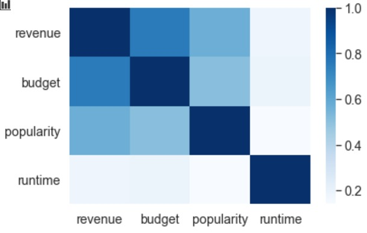


## Missing data
```python 
# The raw data contains Empty values as ['[]', '{}', '']. we will replace those values with None just for an easier view 
train_na = train_raw.replace(to_replace =['[]', '{}', ''], value = np.nan)
test_na = test_raw.replace(to_replace =['[]', '{}', ''], value = np.nan)
```

``` python
print ("Train missing values :")
train_na.isnull().sum().sort_values(ascending=False)
```

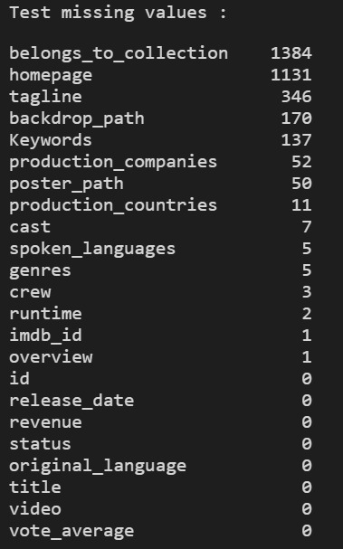

``` python
print ("Test missing values :")
test_na.isnull().sum().sort_values(ascending=False)
```

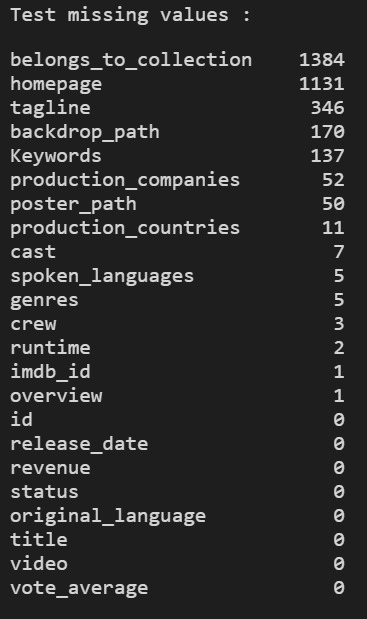


- The feature <b>'belongs_to_collection'</b> contains many None's. That makes sense because most the movies are not part of a collection 
- The features <b>'homepage'</b> & <b>'tagline'</b> also has many None values.
That makes them preaty unrelevant for out task because if imputation is required (not necessarily) we won't be able to apply it without additional data. Also the percentage of None values is ~50% & ~20% accordingly (high numbers)
- The features <b>'backdrop_path'</b> & <b>'poster_path'</b> refer to images which are irrelevant for our task 

## Feature Engineering

### Unpack nested columns
First, we should unpack all the nested attrubutes in the columns.

We used <b>eval</b> to convert the string representation of an attrubutes to an object.
Following, we extracted the relevant information (in our opinion) from each column as follows:

- `belongs_to_collection_ids` : If a movie belongs to a collection - we keep the collection id, else None.
- `genres` : The genre `name` attributes
- `production_comapnies_names` & `production_comapnies_origin_country` : List of production company names attribute & production companies origin country.
- `production_countries` : List of countries (`iso_3166`) where the movie was filmed.
- `release_month`, `release_year` : The month & year the film was released on.
- `spoken_languages_len` : Number of spoken languages in the movie (`iso_639` attribute).
- `Keywords_names` : List of name attribute for each Keyword.
- `cast_len` : Number of members in the cast.
- `crew` : We created a column for each department in the dataset(there are 12).
In each column you can find the numbers of members in the crew from the fitting department.
- `crew_directors_names` - A column that contains a tuple of each of the director's names


```python
cols_to_drop = ['backdrop_path', 'homepage', 'imdb_id', 'original_title', 'poster_path', 'status', 'video']
train_raw = drop_column(train_raw, cols_to_drop)
test_raw = drop_column(test_raw, cols_to_drop)
```
We threw all the columns we had not used at all.

``` python 
flatten_train_df = flatten_features(train_raw)
flatten_test_df = flatten_features(test_raw)
```

```python
flatten_train_df.head()
```
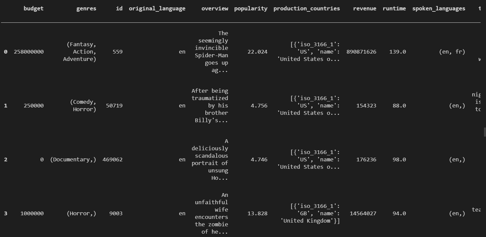

``` python
flatten_test_df.head()
```

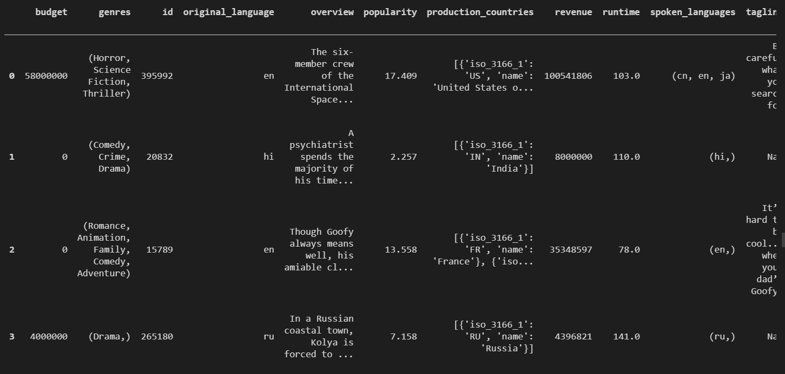

### Our features candidates (before feature selection):

- `collection_size` : The amount of movies in the collection (1 if the movie is not part of a collection) - will derive from `belongs_to_collection` column.
- `budget` : The budget column in a normelize form (log/ min-max normalization)
- `[gener name]` : Dummy column for each gener (19 geners in the universe)
- `[language]` : Dummy column for the 5 most frequent movie's original languages in our universe
- `overview_word_count` : Amount of words in overview
- `popularity` : The popularity column in a normelize form (min-max normalization)
- `[production company id]` : Dummy column for the 5 most frequent movie's production companies
- `num_films_of_biggest_company` : The numbers of films that the biggest production company (The one with the hightes number of films) that participates in this movie has produced (From the currect universe)
- `num_films_of_biggest_country` : The numbers of films that the biggest production country (The one with the hightes number of films) that participates in this movie has produced (From the currect universe)
- `released_year` : The year that the movie was realed on
- `released_month` : The month that the movie was realed on
- `runtime` : The moview lenth in minutes, normelized (min-max normalization)
- `spoken_lang_len` : The amount of spoken languages in a film.
- `is_english_spoken` : Binary column, 1 if English is one of tthe spoken langueges and 0 otherwize.
- `tagline_char_count` : The length (characters) of a tagline.
- `title_char_count` : The length (characters) of a title.
- `sum_votes` : The sum of votes for the movie(calculated by vote_avg * vote_count), in a normelized form (min-max normalization).
- `[Keywords]` : There are ~10,000 unique keywords in train data, so we will create dummy column for each of the top 20 most-frequent keywords in the universe.
- `cast_len` : The nubmer of members in the cast, in a normelized form (min-max normalization).
- `cast_genders_ratio` : The gender ratio (`Females / Females + Males`) of cast.
- `[actor name]` : Dummy column for the 10 most frequent actors in our universe
- `[department name]` : The nubmer of members in the each department, in a normelized form (min-max normalization).
- `[director name]` : Dummy column for the 10 most frequent directors in our universe
- `avg_popularity_by_year` : Mean popularity of films in the released year of a movie.

* Overall we added 81 dummies


```python
extracted_train = extract_features(flatten_train_df, set_of_departments, 'train')
extracted_train.head()
```

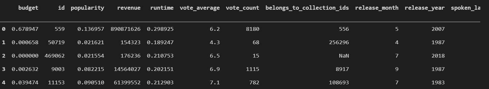

```python
extracted_test = extract_features(flatten_test_df, set_of_departments, 'test')
extracted_test.head()
```

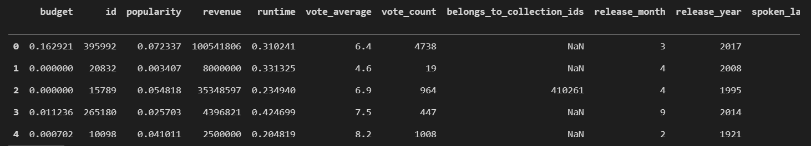

## Some more EDA before after flattning the df and extraction of features
- How many movies do we have in each year, month? 

```python
plt.figure(figsize=(20, 14))
plt.subplot(2, 1, 1)
sns.countplot(extracted_train['release_year'], palette="Set3")
plt.xticks(rotation=90)
plt.subplot(2, 1, 2)
sns.countplot(extracted_train['release_month'],palette="Set3")
plt.xticks(rotation=90)
plt.show()
```


### Handling missing data

We used KNN (`k = 5, Euclidean distance`) Imputation to find budget & runtime for films with zero values.

```python
imputated_train =  imputation(extracted_train)
imputated_test =  imputation(extracted_test)
```

```python
imputated_train.head()
```
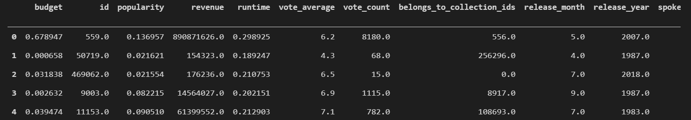

```python
imputated_test.head()
```
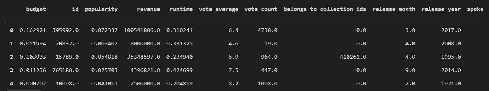

## Prediction

We tried multiple models.. We decided to show 3 of the models that got the best scores -  xgboost, lightgbm and RandomForestRegressor
- For each model, we did the hyperparameter tuning & CV with RandomizedSearchCV module which is implemented as part of sklearn.model_selection. RandomizedSearchCV tune the hyperparameter by cross-validated (5 folds) search over parameter settings. It chooses n_candidates (10) from the given ranges.
- Due to long runtimes when trying to find the best hyperparameters for each model, we chose a sample of parameters to tune:

- <b> XGBoost </b> :
- `max_depth` :range(5, 7),
- `min_child_weight`:range(2, 4),
- `n_estimators`: range(750, 1000),                       
- `reg_alpha`: range(2, 4)

- <b> LGBMRegressor </b> :
- `max_depth` :range(-1, 5),          
- `min_child_weight`:range(0, 1),      
- `n_estimators`: range(100, 500),

- <b> RandomForest </b> :
- `n_estimators` : range(1000,1500)                        
- `max_depth` : range(10,50)


- The chosen parametes for each model will be presented below.
- The validation is performed with the hyper parameter tuning.
- The models performance were measured by the RMSLE measurment. We will present the best results that each model was able to achieve according to the measurment & hyperparameters
- For our chosen model (XGBRegressor) we plot a feature importance graph 

```python
Y_train = imputated_train['revenue']
X_train = imputated_train.drop(['revenue'], axis=1)
Y_test = imputated_test['revenue']
X_test = imputated_test.drop(['revenue'], axis=1)
```

 ## Hyperparameter selection
- We couldn't tune all the params.. so we chose some of the defualt\ known best params for our mission

```python
ddef tune_params(model, params,x_train,y_train): 
    tuned_model = RandomizedSearchCV(estimator=model, param_distributions=params, n_iter = 10,
                                scoring='neg_mean_squared_log_error', verbose=2, random_state=42,
                                n_jobs=-1, return_train_score=True)

    tuned_model.fit(x_train, y_train) 
    print(tuned_model.best_params_)
    return tuned_model.best_params_

def train_model(train, label, model, model_name):
    model.fit(train, np.log1p(label))
    with open(f'models/{model_name}.pkl', 'wb') as f:
        pickle.dump(model, f)
    predictions = np.expm1(model.predict(train))
    RMSLE = np.sqrt(mean_squared_log_error(label, predictions))
    print(f"RMSLE for train dataset for {model_name} model is: {round(RMSLE, 4)}")
    return model

def evaluate_model(test, label, trained_model, model_name):
    if model_name == 'xgb':
        xgb.plot_importance(trained_model, max_num_features=10)
        plt.rcParams["figure.figsize"] = (25, 8)
        plt.show()
    predictions = np.expm1(trained_model.predict(test))
    RMSLE = np.sqrt(mean_squared_log_error(label, predictions))
    print(f"RMSLE for test dataset for {model_name} model is: {round(RMSLE, 4)}")
    return predictions
 ```

### LBG

```python
lgb_params = {'boosting_type': 'gbdt',
                'class_weight': None,
                'colsample_bytree': 1.0,
                'importance_type': 'split',
                'learning_rate': 0.1,
                'min_child_samples': 20,
                'min_split_gain': 0.0,
                'n_jobs': -1,
                'num_leaves': 31,
                'objective': 'regression',
                'random_state': None,
                'reg_alpha': 0.0,
                'reg_lambda': 0.0,
                'silent': True,
                'subsample': 1.0,
                'subsample_for_bin': 200000,
                'subsample_freq': 0,
                'max_depth':-1,
                'min_child_weight': 0.04,
                'n_estimators': 100}

X = X_train.rename(columns=lambda x: re.sub('[^A-Za-z0-9_]+', '', x))
lgb_model = lgb.LGBMRegressor(**lgb_params)
# create tuned model
lgb_model = lgb.LGBMRegressor(**lgb_params)
# train model
lgb_model = train_model(X, Y_train, lgb_model, 'lgb')
# evaluate
X_test_lgb = X_test.rename(columns=lambda x: re.sub('[^A-Za-z0-9_]+', '', x))
lgb_predictions = evaluate_model(X_test_lgb, Y_test, lgb_model, 'lgb')
```

### Random Forest
```python
from sklearn.ensemble import RandomForestRegressor
rf_params = {   'n_estimators': 1500,
                'min_samples_split': 2,
                'min_samples_leaf': 2,
                'max_features': 0.4,
                'max_depth': 50,
                'criterion': 'mae',
                'bootstrap': False  }

rf_model = RandomForestRegressor(**rf_params, n_jobs= -1)
# create tuned model
rf_model = RandomForestRegressor(**rf_params, n_jobs= -1)
# train model
rf_model = train_model(X_train, Y_train, rf_model, 'rf')
# evaluate
rf_predictions = evaluate_model(X_test, Y_test, rf_model, 'rf')
```

### XGBoost

```python
xgb_params = {   'subsample': 0.6, 
                'reg_lambda': 10, 
                'reg_alpha': 2, 
                'objective': 'reg:squarederror', 
                'n_estimators': 1000, 
                'min_child_weight': 4, 
                'max_depth': 7, 
                'learning_rate': 0.01, 
                'gamma': 0.5, 
                'colsample_bytree': 0.6 }

# create tuned model
xgb_model = xgb.XGBRegressor(**xgb_params, n_jobs=-1)
# train model
xgb_model = train_model(X_train, Y_train, xgb_model, 'xgb')
# evaluate
xgb_predictions = evaluate_model(X_test, Y_test, xgb_model, 'xgb')
```

### Let's plot the predictions to see the best fit

```python
df_revenue_time_series = pd.DataFrame()
df_revenue_time_series['true_label'] = list(Y_test)
df_revenue_time_series['release_year'] = list(X_test['release_year'])
df_revenue_time_series['xgb_pred'] = list(xgb_predictions)
df_revenue_time_series['lgb_pred'] = list(lgb_predictions)
df_revenue_time_series['rf_pred'] = list(rf_predictions)
```

```python
ax = plt.gca()
df_plot_results = df_revenue_time_series[['release_year','true_label','xgb_pred','lgb_pred','rf_pred']].groupby('release_year').mean()
df_plot_results['year'] = df_plot_results.index
plt.rcParams['figure.figsize'] = [20, 10]
plt.title('Predictions comparison over the years')
df_plot_results.plot(kind='line',x= 'year' ,y ='true_label', ax = ax)
df_plot_results.plot(kind='line',x= 'year' ,y ='xgb_pred',ax = ax)
df_plot_results.plot(kind='line',x= 'year' ,y ='lgb_pred',ax = ax)
df_plot_results.plot(kind='line',x= 'year' ,y ='rf_pred',ax = ax)

```

### Conclusions
- As you can see, the evaluation results for the 3 models were pretty similar.
- We chose our final model to be XGBRegressor because it got the lowest RMSLE
- From the feature importance graph we can learn wich features affects most on the model

